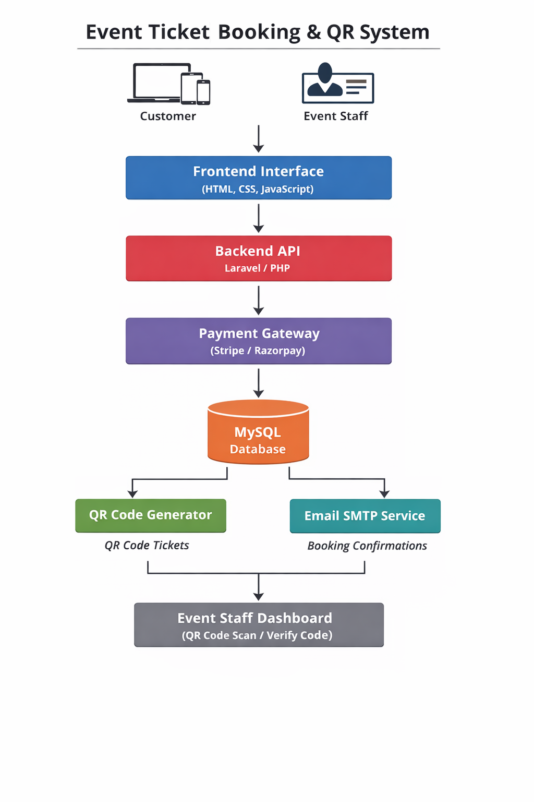

# 🎟 Event Ticket Booking Platform with QR Code Verification & Payment Gateway

Laravel-based event ticket booking system with payment gateway integration, QR code tickets, and real-time event attendance verification.

A complete **event ticket booking platform** that allows users to purchase event tickets online using a payment gateway and receive a **unique ticket code and QR code** via email.

Event staff can verify attendees at the venue by **scanning the QR code or entering the ticket code manually**, ensuring a secure and fast check-in process.

⚡ **Portfolio Project – Built to demonstrate full-stack development, payment gateway integration, QR-based ticket verification, and event management systems.**

---   

# 📌 Project Overview

Event organizers often face challenges managing ticket sales and attendee verification manually.  
This can lead to long queues, duplicate ticket usage, and poor attendee experience.

This project provides a **complete digital solution for event ticket booking and entry verification**, enabling organizers to sell tickets online and manage event attendance securely.

After successful ticket purchase:

- A **unique ticket code** is assigned
- A **QR code ticket** is generated
- Ticket is sent to the customer via **email**

At the event venue, staff members can **scan the QR code or verify the ticket code** to mark the attendee as present.

---

# 🚨 Problem

Event organizers often struggle with:

- Manual ticket management
- Duplicate ticket usage
- Slow entry verification
- Lack of attendance tracking

A system was needed to automate **ticket booking, secure ticket generation, and real-time attendee verification**.

---

# 💡 Solution

This platform automates the complete event ticket workflow:

- Online ticket booking
- Secure payment processing
- Unique ticket code assignment
- QR code ticket generation
- Email ticket delivery
- QR code scanning for event entry
- Attendance tracking dashboard

---

# 🚀 Key Features

## Customer Features

- Browse upcoming events
- View event details
- Purchase tickets online
- Secure payment gateway integration
- Receive booking confirmation email
- Receive **unique ticket code**
- Receive **QR code ticket**
- Show QR code at event entrance

---

## Admin Features

- Admin dashboard
- Create and manage events
- View all ticket registrations
- Import or generate unique ticket codes
- Manage bookings and payments
- Assign event staff members
- Track ticket usage and attendance

---

## Event Staff Features

Event staff members can log in to the event dashboard and:

- Scan ticket QR codes
- Verify ticket codes manually
- Mark attendees as **checked-in**
- Prevent duplicate entries       

---

# 🎫 Unique Ticket Code System

Each ticket is assigned a **unique ticket code**.

Example:
Enter Code: EVT-98234
Enter Code: EVT-98235
Enter Code: EVT-98236
Enter Code: EVT-98237

When a ticket is purchased:

1. System assigns an unused code
2. Code is linked with the order
3. Ticket confirmation email is sent to the customer

---

# 📱 QR Code Ticket System

After payment confirmation:

The system generates a **QR code ticket** containing:

- Ticket ID
- Unique Ticket Code
- Event ID
- Customer Email

The QR code is sent to the customer via email and scanned during the event.

---

# ✅ Ticket Verification Process

## QR Code Scan

Event staff scans the QR code.

System verifies:

- Ticket exists
- Ticket belongs to event
- Ticket has not already been used

If valid:
Status: Valid Ticket
Attendance: Marked

---

## Manual Code Entry

Staff can also verify tickets manually.

Example:
Enter Code: EVT-98234

The system verifies the ticket and marks attendance.

---

# 📊 Attendance Tracking

Ticket statuses:
Available
Reserved
Confirmed
Attended
Invalid

Admin dashboard shows:

- Total tickets sold
- Total attendees checked-in
- Remaining tickets

---

## System Architecture

The platform follows a modular architecture where the frontend communicates with a Laravel backend API, which manages payments, ticket generation, and event verification.

---

# ⚙ System Workflow

1. User browses available events
2. User purchases ticket via payment gateway
3. System verifies payment
4. System assigns unique ticket code
5. QR code ticket generated automatically
6. Ticket sent to customer via email
7. Event staff scans QR code at entrance
8. System marks ticket as attended

---

# 💻 Tech Stack

### Backend
- Laravel / PHP

### Frontend
- HTML5
- CSS3
- Bootstrap
- JavaScript
- AJAX

### Database
- MySQL

### Integrations
- Payment Gateway (Stripe / Razorpay)
- QR Code Generator
- Email SMTP Service

### Tools
- Git
- GitHub

---

## 🌐 Live Demo

Portfolio Case Study:
https://mukeshprajapat026.github.io/projects/event-ticket-system.html

---

## 🏷 Tags

`laravel` `event-booking` `qr-code` `payment-gateway` `ticket-system`

---

# 🔮 Future Improvements

- Mobile QR scanning application
- SMS ticket notifications
- Event analytics dashboard
- Multi-event management
- Mobile ticket wallet
- Real-time event reporting

---

# 👨‍💻 Author

**Mukesh Prajapat**

Full Stack Developer

Expertise:

- Laravel Development
- Shopify Development
- WordPress Development
- API Integrations
- Payment Gateway Systems
- Booking Platforms

---

⭐ If you found this project helpful, consider giving it a **star**.